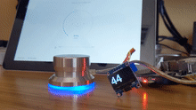

# Cattmate

A WiFi enabled physical volume knob for Chromecasts via a mash up of Griffin's no longer made USB device the 
[PowerMate](https://support.griffintechnology.com/product/powermate/) and
the awesome python Chromecast controlling library [catt](https://github.com/skorokithakis/catt/)
using the equally awesome [powermate-linux](https://github.com/stefansundin/powermate-linux)
 app.

Here's the current demo in an animated gif.  Behind the PowerMate is a Chromebook running the
Google Home app.  When the Cattmate sets the volume it shows a smiley face on the screen and you 
can kinda make out Google Home update as well:

**Note** - This project is very much a work in progress. It is not fully functional yet! Don't 
use unless you're looking to learn and experiement like am right now ;)   

## Install

1. Make sure the following requirements are installed:
   * [powermatte-linux](https://github.com/stefansundin/powermate-linux)
   * [pip](https://pip.pypa.io/en/stable/installing/)
   * [virtualenv](https://virtualenv.pypa.io/en/stable/) 
1. Clone this repo `git clone https://github.com/Ths2-9Y-LqJt6/cattmate.git`
1. Change directories to cattmate `cd cattmate`
1. Create your own virtualenv and activate it `python3 -m venv venv;. venv/bin/activate` (_optional_)
1. Install all the python prerequesites with `pip install -r requirements.txt`
1. Create your own config file `cp config.dist.py` and edit `config.dist` with the names or IPs
of the chromecasts you want to use (ony first one supported right now....)
1. Start the cattmate controller `python3 cattmate.py` and start the powermatte-linux software
specifying the config file you edited above: `/usr/bin/powermate -c powermate.toml`
